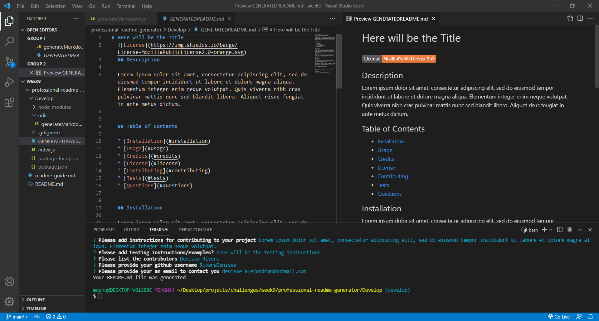
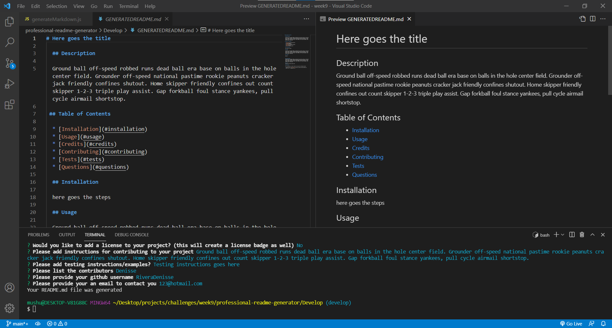

# PROFESSIONAL-README-GENERATOR
  
  ## Description

  This project will help generate a README file using Node.js and users input

 
  ## Table of Contents

  * [Installation](#installation)
  * [Usage](#usage)
  * [Video](#video)
  * [Credits](#credits)
  * [License](#license)
  * [Contributing](#contributing)
  * [Tests](#tests)
  * [Questions](#questions)
  
  
  ## Installation

  To generate a README file please follow the steps below: 
  * Clone the repository to your computer 
  * Run _**npm install**_ in your terminal to create a package.json file (in order to install the npm package dependencies listed below) 
  * Install inquirer package from npm by typing in your terminal _**npm install inquirer**_

  ## Usage

  From the terminal in the directory of this project (*Develop folder*) type _**node index**_ to run the program;then the program will prompt a series of questions in order to generate the README file, answer all questions accordingly. Once the user answers all questions, the program will fill out the README template(located in "generateMarkdown.js" and create a README file using the user's input. If the file is created successfully the program will give a "Your README. md file was generated".

  Example of README file when license is selected

  
 
  Example of README file when no license is selected

  

  here is a link to a video showing

  ## Video

  A walkthrough video of the application is available [here](https://drive.google.com/file/d/1aOuXstdIdXz93aiuDKL5dS26_diY9t0c/view)

  ## Credits

  The following websites were used in order to create this application:
  * [Mastering Markdown](https://guides.github.com/features/mastering-markdown/)
  * [Choose an open source license](https://choosealicense.com/)
  * [shields.io](https://shields.io/)
  * [Contributor Covenant](https://www.contributor-covenant.org/)

  ## License
  This application is covered by MIT License. For more information about the license please click [here](https://choosealicense.com/licenses/mit/)

  ## Contributing
  If you would like to contribute to this project please follow the Contributor Covenant(industry standard) which can be located in [here](https://www.contributor-covenant.org/)

  ## Tests
  There are no testing instructions. But if you would like to add or have any testing/example ideas please contact me using the information found under "Questions" section

  ## Questions

  For any questions, please contact me using the information below:

  * Github Profile: [RiveraDenisse](https://github.com/RiveraDenisse)
  * Email me at : denisse_alejandrar@hotmail.com
